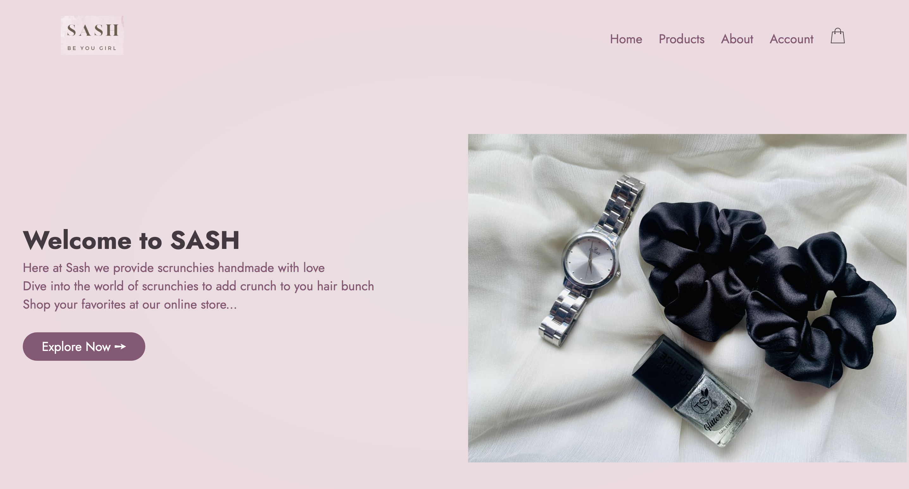
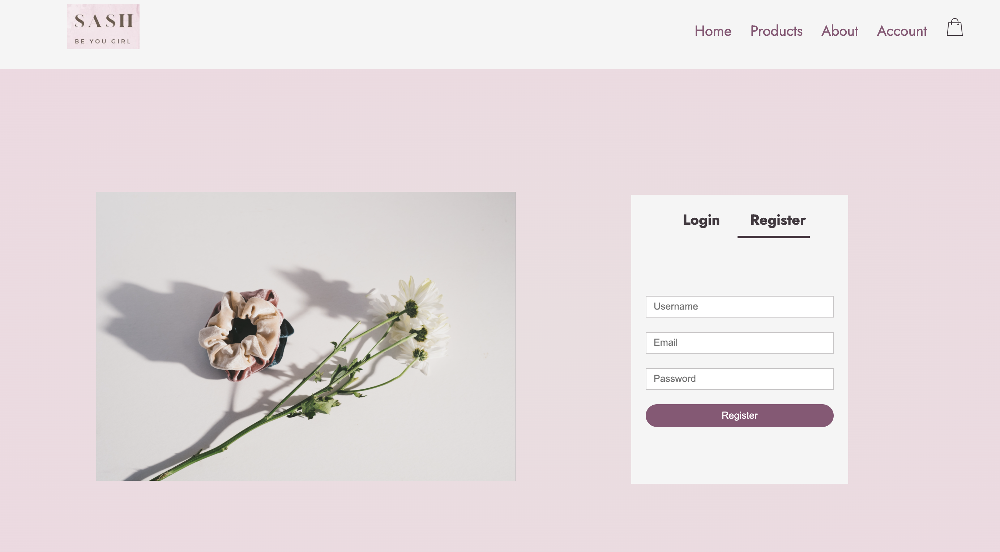
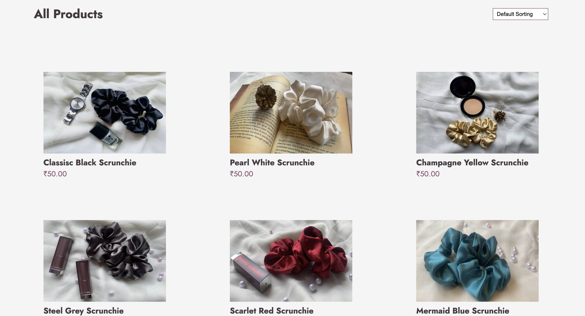
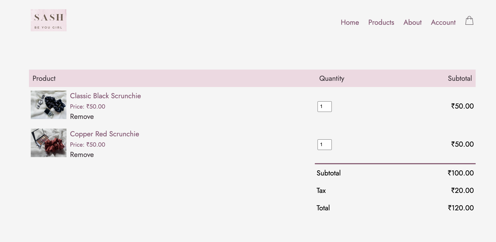

# Hair Accessories E-Commerce Website

SASH is a static e-commerce website designed to showcase and sell a variety of hair accessories. The website provides users with a platform to browse through different categories of hair accessories, view product details, and make purchases.

### Home Page

### Login Page

### Product Page

### Cart Page

## Features

- **Product Display**: Browse through a selection of hair accessories, including hair clips, headbands, scrunchies, and more.
- **Product Details**: View product images, descriptions, and prices to make informed purchasing decisions.
- **Responsive Design**: Enjoy a seamless browsing experience across devices, thanks to the website's responsive design.

## Technologies Used

- HTML
- CSS
- JavaScript

## Usage

To view the Hair Accessories E-Commerce Website, simply open the `index.html` file in your preferred web browser.

## Contributing

Contributions to this project are welcome! If you'd like to contribute new features, enhancements, or bug fixes, feel free to fork the repository and submit a pull request.

## License

This project is free to use and does not contains any license.
